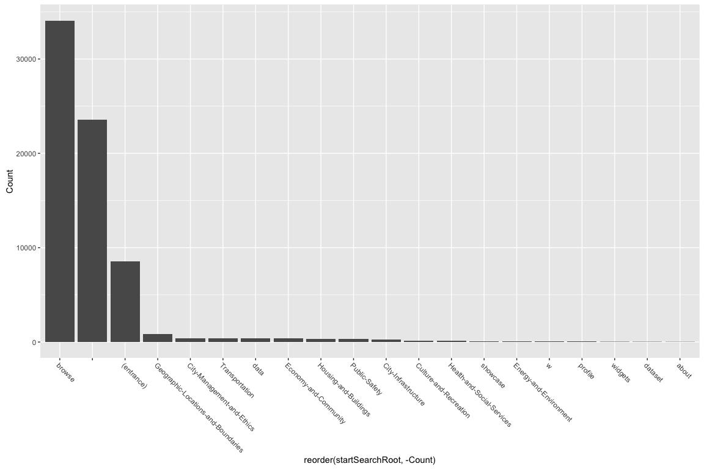
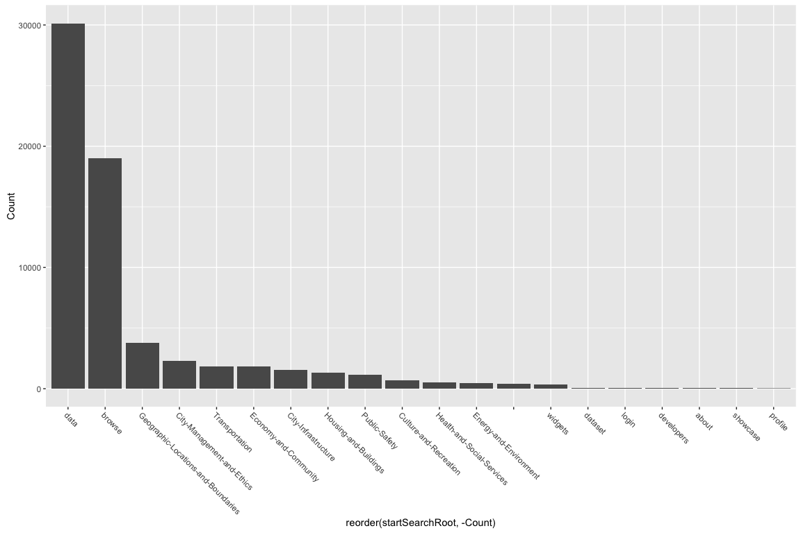
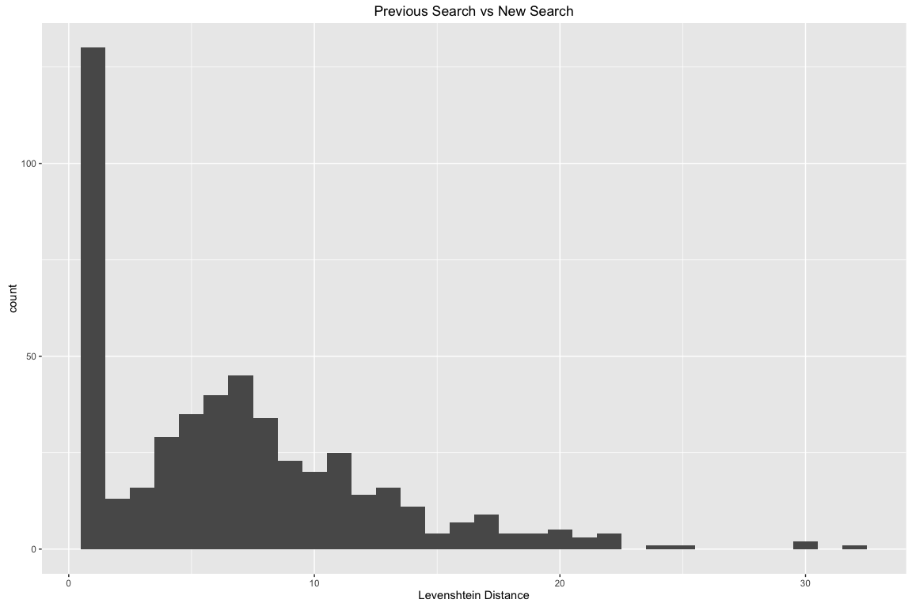

*below wording could be improved*
One of the immediately interesting things about the data is how often people are searching the same term multiple times in one session. We can sum all of the unique search counts and take the times that ga.searchUniques equals 0 and see that a search is at least 93% as likely to be a reran search as to be new for the user during the session. In reality this is likely even more common because ga.searchUniques does not increase if multiple people have made multiple searches for a term with all the other variables also being the same.

Searches originate from 46.2 thousand different urls, mostly due to previous search results and other metadata being appended to the url. Focusing on just the root domains brings us down to 46, with the vast majority of searches coming from the browse and entrance pages.

Looking at just when users search for the same term multiple times in a session, the data root domain jumps to the lead and all of the more specific categories rise.

By separating previous searches out of ga.searchStartPage we can look at what was searched in succession. Shockingly to me, in 98% of these cases people searched the same term again. For the other 2%, it's pretty interesting to see how people change their queries, which can be viewed in the changed\_searches.csv.

Since 98% of searches have 0 character changes it doesn't make a very interesting plot at all. Ignoring that, the most common change for people to make is one character (normally a typo fix).

More interesting are the searches with a Levenshtein distance over 3. This is when users start really refining their searches or abandon them completely, so it's an exilent place for Jason and us to take over for the machines. Plus it brings us down to a managable ~340 searches to focuse on.

From here we can look into:

-   If the data is available is it poorly tagged, labled, or named?
-   If the data isn't available, can we make it so?
-   Can we use this as proof to show departments people want your data available?

| Search Term |  Search Count|  In Published Descriptions|  In Unublished Descriptions|  Dataset Results|  All Results|
|:------------|-------------:|--------------------------:|---------------------------:|----------------:|------------:|
| topography  |           134|                          0|                           0|                0|            0|
| poop        |            74|                          0|                           0|                0|            0|
| alcohol     |            69|                          0|                           0|                0|            0|
| topo        |            69|                          2|                           0|                0|            0|
| tourism     |            50|                          0|                           0|                0|            0|
| contour     |           113|                          1|                           0|                0|            1|
| contours    |           107|                          1|                           0|                0|            1|
| json        |            65|                          1|                           0|                0|            1|
| aerial      |            62|                          1|                           0|                0|            1|
| accident    |            56|                          0|                           0|                0|            1|
| accidents   |            51|                          0|                           0|                0|            1|
| bart        |           189|                          0|                           1|                0|            2|
| shoreline   |           122|                          2|                           0|                0|            2|
| earthquake  |            68|                          2|                           0|                0|            2|
| wind        |            66|                          3|                           0|                0|            2|
| density     |            58|                          1|                           0|                0|            2|
| roads       |           168|                          2|                           0|                0|            3|
| road        |           106|                          5|                           1|                0|            3|
| library     |            76|                          6|                           4|                0|            4|
| taxi        |           176|                          1|                           0|                0|            5|
| film        |            74|                          1|                           2|                1|            1|
| flood       |            69|                          1|                           0|                1|            1|
| poverty     |            64|                          0|                           0|                1|            1|
| movie       |            52|                          1|                           0|                1|            1|
| restaurants |           428|                          0|                           0|                1|            2|
| restaurant  |           336|                          2|                           1|                1|            2|
| elevation   |           253|                          1|                           0|                1|            2|
| sewer       |           103|                          3|                           0|                1|            2|
| waste       |            62|                          2|                           0|                1|            2|
| muni        |           313|                         36|                          20|                1|            3|
| footprint   |            81|                          2|                           1|                1|            3|
| dem         |            67|                         12|                          32|                1|            3|
| footprints  |            59|                          1|                           1|                1|            3|
| bus         |           155|                         16|                          16|                1|            4|
| hospital    |            78|                          1|                           2|                1|            4|
| hospitals   |            61|                          1|                           0|                1|            4|

Call each search term and see how many results there is: <https://data.sfgov.org/browse?q=street%20cleaning> Maybe limit to dataset and external

Can look at what the value as assigned by department is and see if true.
